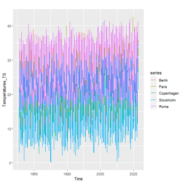
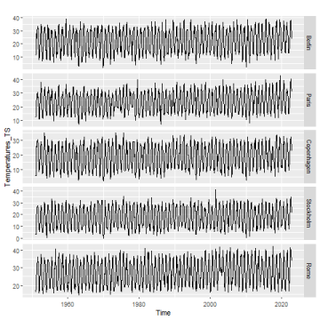
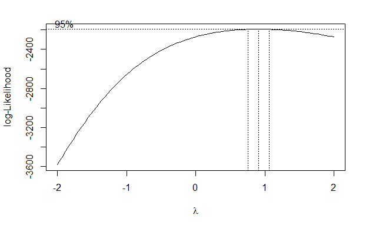
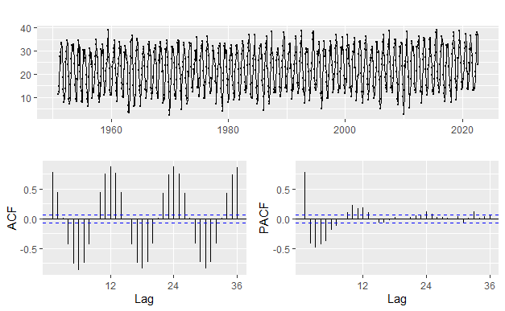
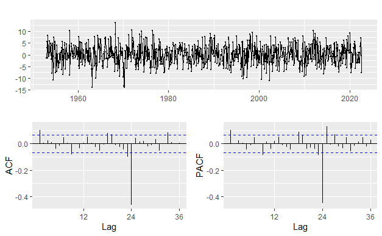
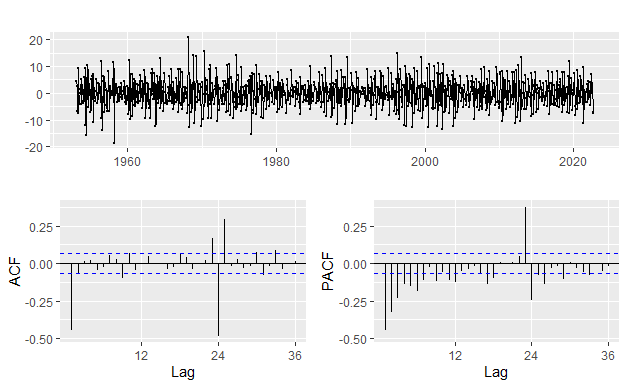
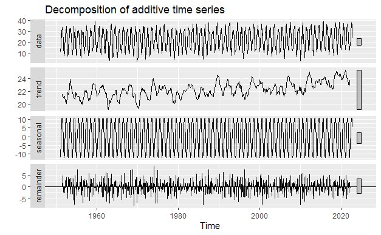

```{r setup, include=FALSE}
knitr::opts_chunk$set(echo = TRUE)
```

\doublespace

Within a century, the world has seen great changes in its climate. Countries around the world have now been experiencing harsher weather patterns with 
extreme weather events becoming the norm. Among these changes is a global change in temperature. In order to find the significance of the climate change, data  about the temperature over tens of years in different places around the world would be necessary. Here we will be analyzing Europe because of the different climates throughout the continent while still being relatively close together. By choosing only locations within Europe, there could be an analysis seeing a relationship between location and temperature change as well as just the temperature change. Because the location and the environment could have an effect on the climate, it is necessary to look that these variables and see they make any significant difference to the temperature. Being able to tell whether there is a significant change in the climate would make understanding just how problematic global warming really is. It would allow people to be able to get a digestible number that can anyone can understand. It can make people really understand how the world is changing without having to fully explain everything that is really going on. 

It should be noted that this is a very common thing to study because of how important understanding climate change its recent effects. This means that there are definitely plenty of researchers also studying data similar to this. Although there are many studies surrounding this phenomenon, there are still many questions that we feel are still just a bit confusing such as: Just how much has the temperature increased? Are there differences in the amount of temperature increase and the location? If location matters, is it an effect of the environment or is it an effect of solely the location? The data used in this analysis originates from the website [Data Commons](https://www.datacommons.org/) and they had acquired their data from [noaa.gov](https://www.noaa.gov/) also known as, \textbf{National Ocean and Atmospheric Administration}. From here, we were able to get the maximum temperatures in Celsius of each month since 1951 from the cities Berlin, Paris, Copenhagen, Stockholm and Rome. The choosing of these cities was more or less arbitrary, but there was still some reasoning in their choosing. We wished to have a cities that we on different latitudes and longitudes and cities that had a history of a very obvious change in climate. On the next page, Figure 1 and Figure 2 both show the monthly maximum temperature throughout the years with Figure 1 shows all the temperature layered on top of each other and Figure 2 shows each one individually.





Using the formula below, we found that the mean was 22.29, 23.64, 18.86, 17.86, and 27.21 for the cities Berlin, Paris, Copenhagen, Stockholm, and Rome, respectively and the notation used for Berlin is included.

$$E(Y_t) = \frac{1}{n}\sum^n_{i=1}Y_i $$
$$E(Y_{\text{Berlin}, t}) = \frac{11.2 + 12.5 +...+24.0}{861} = 22.29$$

After conducting a Box Cox, as seen from the plot below (Figure 3), we can see that $\lambda$ is roughly equal to 1 so we do not have to do any transformation to the time series. 












