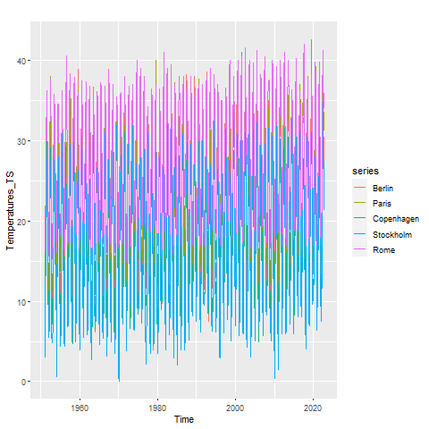
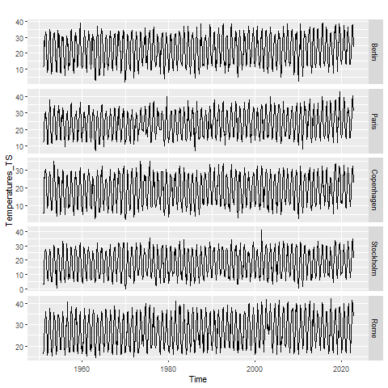

```{r setup, include=FALSE}
knitr::opts_chunk$set(echo = TRUE)
```

\doublespace

Within a century, the world has seen great changes in its climate.[] Countries 
around the world have now been experiencing harsher weather patterns with 
extreme weather events becoming the norm. Among these changes is a global change
in temperature. In order to find the significance of the climate change, data 
about the temperature over tens of years in different places around the world
would be necessary. Thankfully, there exists such data and this will be an analysis
focusing on climate change within Europe.

FIX THIS^^^^^ Its too elementary

Analyzing Europe would be beneficial because of the different climates throughout
the continent while still being relatively closer together. This makes it so that
there could be an analysis around location and temperature change. Because the 
location and the environment could have an effect on the climate, it is necessary 
to look that these variables and see they make any significant difference to the
temperature.

The data originates from the website [Data Commons](https://www.datacommons.org/)
and they had acquired their data from [noaa.gov](https://www.noaa.gov/) also
known as, \textbf{National Ocean and Atmospheric Administration}. 

Being able to tell whether there is a significant change in the climate would
make understanding just how problematic global warming really is. It would allow
people to be able to get a digestible number that can anyone can understand. It
can make people really understand how the world is changing without having to 
fully explain everything that is really going on. 

This is a very common thing to study because of how important understanding 
climate change its recent effects. This means that there are definitely plenty
of researchers also studying this data.

Just how much has the temperature increased? Are there differences in the amount
of temperature increase and the location? If location matters, is it an effect 
of the environment or is it an effect of solely the location?






