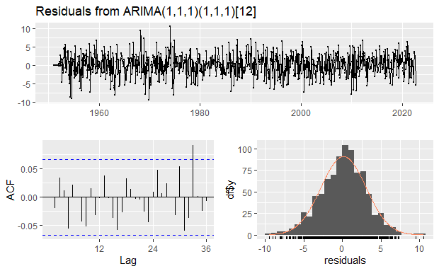
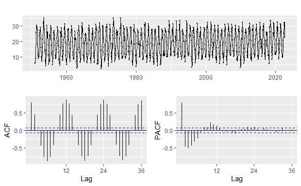
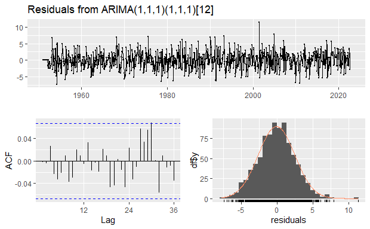

```{r setup, include=FALSE}
knitr::opts_chunk$set(echo = TRUE)
```

Within a century, the world has seen great changes in its climate. Countries around the world have now been experiencing harsher weather patterns with 
extreme weather events becoming the norm. Among these changes is a global change in temperature. In order to find the significance of the climate change, data  about the temperature over tens of years in different places around the world would be necessary. Here we will be analyzing Europe because of the different climates throughout the continent while still being relatively close together. By choosing only locations within Europe, there could be an analysis seeing a relationship between location and temperature change as well as just the temperature change. Because the location and the environment could have an effect on the climate, it is necessary to look that these variables and see they make any significant difference to the temperature. Being able to tell whether there is a significant change in the climate would make understanding just how problematic global warming really is. It would allow people to be able to get a digestible number that can anyone can understand. It can make people really understand how the world is changing without having to fully explain everything that is really going on. 

It should be noted that this is a very common thing to study because of how important understanding climate change its recent effects. This means that there are definitely plenty of researchers also studying data similar to this. Although there are many studies surrounding this phenomenon, there are still many questions that we feel are still just a bit confusing such as: Just how much has the temperature increased? Are there differences in the amount of temperature increase and the location? If location matters, is it an effect of the environment or is it an effect of solely the location? The data used in this analysis originates from the website [Data Commons](https://www.datacommons.org/) and they had acquired their data from [noaa.gov](https://www.noaa.gov/) also known as, \textbf{National Ocean and Atmospheric Administration}. From here, we were able to get the maximum temperatures in Celsius of each month since 1951 from the cities Berlin, Paris, Copenhagen, Stockholm and Rome. The choosing of these cities was more or less arbitrary, but there was still some reasoning in their choosing. We wished to have a cities that we on different latitudes and longitudes and cities that had a history of a very obvious change in climate. On the next page, Figure 1 and Figure 2 both show the monthly maximum temperature throughout the years with Figure 1 shows all the temperature layered on top of each other and Figure 2 shows each one individually.


Here, we let $Y_t$ denote the monthly max temperatures in each city. Using the formula below, we found that the mean was 22.29, 23.64, 18.86, 17.86, and 27.21 for the cities Berlin, Paris, Copenhagen, Stockholm, and Rome, respectively and the notation used for Berlin is included.

$$E(Y_t) = \frac{1}{n}\sum^n_{i=1}Y_i $$
$$E(Y_{\text{Berlin}, t}) = \frac{11.2 + 12.5 +...+24.0}{861} = 22.29$$

\newpage

# Berlin

For this analysis, we will be conducting most experiments using the Berlin sample and applying models to the other samples after and potentially adjusting them to fit the other samples better. Here we conducted a Box Cox, as seen from the plot below (Figure 3), to see if any transformation was necessary. We found that because $\lambda$ is roughly equal to 1 so we do not have to do any transformation to the time series. 


From the decomposition, Figure 4, of the time series in regards to Berlin, we can see that there is a clear seasonal component. Even just looking at the ACF of the time series, Figure 5, there is a clear seasonality from the similar wave like motion in between the months. Because of the seasonal component and the non stationary ACF plot from the time series, we take the difference and see what that does to the new ACF. 


After taking the difference, as seen from Figure 6, we could see that there is a significant spike at lag 1 for both the ACF and PACF indicates that there could be a non-seasonal MA(1) component. There is also a significant spike at lag 24 and 25 in the PACF which suggests that there could be a seasonal AR(1) component. This seasonal AR(1) could also explain why lags 23, and 24 in the ACF model are significant. Therefore, we will begin with a ARIMA(0,0,1)(1,1,0) for $Y_t$.

$$ (1 - \Phi_1B^{12})(1 - B^{12})Y_t =  (1 + \theta_1B)Z_t \quad \text{where } Z_t \overset{iid} \sim WN(0, \sigma^2)$$

The fitted model is 
$$(1 + 0.5090 B^{12})(1 - B^{12})Y_t =  (1 + 0.1052 B)Z_t$$
and the variance equals $\sigma^2 = 12.42$


There still appear to be some sort of seasonal component that is significant at lags 12, and 24 for the ACF and for the PACF lags 12, 24, and 36. There, also, seems to be quite a few minor non-seasonal spike at throughout for both plots as well. This indicates that we must include seasonal terms and non-seasonal terms in the model. By adding seasonal terms, we came across the ARIMA(0,0,1)(1,1,1) model. This model has an AIC of 4292.58, while the original model has an AIC of 4294.57 compared to the original model had an AIC of 4556.12. When adding non-seasonal terms to get models such as ARIMA(1,1,1)(1,1,1), the AIC was 4286.01 which is much smaller than all previous models. Through these findings, we will choose the ARIMA(1,1,1)(1,1,1) for this time series.

$$ (1 - \phi_1B)(1 - \Phi_1B^{12})(1-B)(1 - B^{12})Y_t =  (1 + \theta_1B)(1 + \Theta_1B^{12})Z_t $$

The fitted model is:

$$ (1 - 0.1101 B)(1 + 0.0031B^{12})(1-B)(1 - B^{12})Y_t =  (1 - 0.9953B)(1 - 0.9734B^{12})Z_t $$
and the variance is $\sigma^2 = 8.643$




Just from looking at the forecast graph, Figure 9, it would appear to be that the maximum temperature does indeed keep increasing. Although the lower ends of this temperature does not seem to have changed and still appears to be within a reasonable temperature for this location, for the upper end, there is quite a large change in temperature. There is a rather large jump in future temperature in comparison to the our sample in Berlin, as well. From this graph, it shows that the temperature in Berlin would be close to 40 degrees Celsius which would be much higher than any previously recorded data, at least from this data set.  This definitely indicates that there is some sort of trend that indicates that there the maximum temperature will keep increasing showing some signs of global warming. 

\newpage

# Paris


From the ACF and PACF graphs in Figure 10, it is clear that there is an obvious seasonal component. Because there is a seasonal component within the time series for Paris and the series is non-stationary, we can find the difference in order find an appropriate model for this time series.


After taking the difference, we get a graph of the ACF and PACF, Figure 11, and find that there is a significant spike at lag 1 for both the ACF and PACF which could indicate that there is a non-seasonal MA(1) component similar to that from the Berlin data set. It, also, appears to be a significant spike at lag 24 for both the ACF and PACF with the ACF also having a significant spike at lag 25 which could indicate that there is a seasonal AR(1) component. Therefore, we will start off with an ARIMA(0,0,1)(1,1,0) with AIC 4339.41 the same starting model we had for Berlin.

$$(1 - \Phi_1B^{12})(1 - B^{12})Y_t =  (1 + \theta_1B)Z_t$$
The fitted model is
$$(1 + 0.4714B^{12})(1 - B^{12})Y_t =  (1 + 0.1224B)Z_t$$
with a variance of $\sigma^2 = 9.632$


After finding the residuals of the ARIMA model and getting the ACF and PACF of them, we can find them in Figure 12. There still seems to be some sort of seasonal component that is significant in the ACF at lags 12 and 24 and the PACF at lags 12, 24, and 36. This indicates that we must include more seasonal terms in the model. There, also, appears to be a non-seasonal component within the PACF at lags 17 and 19 potentially indicating that there is a non-seasonal component that we must include in the model. After adding a seasonal term, we came to the model ARIMA(0,0,1)(1,1,1) with AIC 4077.35. We added terms for the non-seasonal components and found the two models ARIMA(0,1,1)(1,1,1) and ARIMA(1,1,1)(1,1,1) with AICs 4082.94 and AIC 4067.36, respectively. Because the model ARIMA(1,1,1)(1,1,1) had the lowest AIC, that was the one we ended up using.  

$$ (1 - \phi_1B)(1 - 0.0405B^{12})(1-B)(1 - B^{12})Y_t =  (1 + \theta_1B)(1 + \Theta_1B^{12})Z_t $$

The fitted model is
$$ (1 - 0.1488B)(1 - \Phi_1B^{12})(1-B)(1 - B^{12})Y_t =  (1 - 0.9929B)(1 + - 0.9603B^{12})Z_t $$
with variance $\sigma^2 = 6.732$


In this forecast graph, Figure 14, it would appear to be that the change in maximum temperature is not that egregious. It seems to be that the temperature is still greater than the majority of the previous years, but the jump is not that drastic. Within this sample, these temperatures are not even the largest with a sample somewhere in 2020 had the highest temperature at around 42 degrees Celsius. These forecast temperatures seem to be greater than 40 degrees Celsius which is still really high when we consider the usual max temperatures that this city has. While the jump may not be that drastic, there does seem to be a consistent increase in temperature over the years that does still appear to be happening.


\newpage

# Copenhagen




In Figure 15, the same problem from the last two cities arises in this data set where there is a clear seasonal component and it appears to be non-stationary. Therefore, we must find the difference. 


Figure 16 is the ACF and PACF for the difference for the Copenhagen time series. There is a significant spike at lag 1 for both the ACF and PACF with the ACF also decreasing at lag 1. This indicates that there must be a non-seasonal AR(1) component in the model. The significant spike at lag 24 for both the ACF and PACF indicates that there must be a seasonal component. Because lags 24 and 25 are significant for the PAC, there must be a seasonal AR(1) component. This would mean that the starting model should be ARIMA(1,0,0)(1,1,0) with and AIC of 4350.15.

$$(1 - \phi_1B)(1 - \Phi_1B^{12})(1 - B^{12})Y_t = Z_t$$

The fitted model is 

$$(1 - 0.19681B)(1 + 0.5286B^{12})(1 - B^{12})Y_t = Z_t$$
with variance $\sigma^2 = 9.743$


Figure 12 shows the residuals, ACF and PACF of the Copenhagen data set. The significant spikes at lags 12, and 24 in the ACF and the PACF with the PACF also having a spike at 36 indicates that there is another seasonal component missing that must be included in the model. There are also a few random significant spikes throughout both the ACF and PACF notably at lags 9 and 30 may indicate that there is a non-seasonal component that may be missing and may need to be included in the model. We add a seasonal MA(1) component creating the model ARIMA(1,0,0)(1,1,1) with AIC 4079.97. After this, we looked to see if there was any non-seasonal components missing so we found the models ARIMA(1,1,0)(1,1,1) with AIC 4319.33 and ARIMA(1,1,1)(1,1,1) with AIC 4078.98. Because the model ARIMA(1,1,1)(1,1,1) had the lowest AIC, we concluded that this was the appropriate model for this data set.

$$ (1 - \phi_1B)(1 - \Phi_1B^{12})(1-B)(1 - B^{12})Y_t =  (1 + \theta_1B)(1 + \Theta_1B^{12})Z_t $$

The fitted model is

$$ (1 - 0.1988B)(1 + 0.0400B^{12})(1-B)(1 - B^{12})Y_t =  (1 -0.9958B)(1 -0.9618B^{12})Z_t $$
with variance $\sigma^2 = 6.797$


In this forecast graph, Figure 19, the maximum temperature change is rather drastic in comparison to Paris is more similar to the change in Berlin. Although the temperature is not the greatest in this sample, it is still larger than any recent temperature since around 1975. The max temperature that is forecasted is a bit over 35 degrees Celsius. The lower end appears to be much lower than recent years, as well, being around 5 degrees Celsius. This forecast temperatures seem to be around the extremes of Copenhagen weather and seems to follow a recent trend that indicates that there is a consistent increase in temperature over the past decade or so. The other cities so far seem to also follow the same or similar temperature increase trends.

\newpage

# Stockholm


In Figure 20, we can find the same problem that we had with the other data sets where there is a seasonal component and that the data set is non-stationary. This means taht we must find the difference in order to work with the data appropriately.


Figure 21 contains the ACF and PACF for the Stockholm data set. Here, we can see that there is a significant spike at lag 1 for both ACF and PACF. This along with the ACF decreasing after lag 1 and lag 2 also being significant indicates that there must be a non-seasonal component AR(1). With lags 23,24, and 25 being significant for the ACF and PACF indicates that there must be a seasonal AR(1) component. This means that our starting model should be ARIMA(1,0,0)(1,1,0) with AIC 4325.88.   

$$(1 - \phi_1B)(1 - \Phi_1B^{12})(1 - B^{12})Y_t = Z_t$$

The fitted model is 

$$(1 - 0.2743B)(1 + 0.5347B^{12})(1 - B^{12})Y_t = Z_t$$
with variance $\sigma^2 = 9.467$


The residuals graph in Figure 22 shows that there is a missing seasonal component due to significant spikes at lags 12, 24, and 36 in the PACF and spikes at lags 12, and 24 for the ACF. There is potentially also a missing non-seasonal component due to significant spikes at lags 30 in the ACF and lags 28 and 30 for the PACF. By adding a seasonal component, we found the model ARIMA(1,0,0)(1,1,1) with AIC 4060.31. After adding non-seasonal components, we came across the two models ARIMA(1,1,0)(1,1,1) with AIC 4312.48 and ARIMA(1,1,1)(1,1,1) with AIC 4059.28. Because the model ARIMA(1,1,1)(1,1,1) had the lowest AIC, we chose this to be the final model.

$$ (1 - \phi_1B)(1 - \Phi_1B^{12})(1-B)(1 - B^{12})Y_t =  (1 + \theta_1B)(1 + \Theta_1B^{12})Z_t $$

The fitted model is

$$ (1 - 0.2574B)(1 + 0.0492B^{12})(1-B)(1 - B^{12})Y_t =  (1 -1.000B)(1  -0.9481B^{12})Z_t $$
with variance $\sigma^2 = 6.65$




Based on this graph, Figure 23, we can see that there is a tiny maximum temperature increase. There also appears to be a larger maximum temperature decrease during some parts of the year. Although, the jump was not as drastic as Copenhagen's, there still seems to be an increase. This increase seems to push the temperature to about 36 degrees Celsius, while the lower end seems tot push 5 degrees Celsius. The maximum temperature is also not the greatest temperature found in the data set. The largest temperature in the data is 41 degrees from around 2001 which is much higher than our predicted temperatures.


\newpage

# Rome


In Figure 25, we again see the same issues with season and non-stationary so we must find the difference of the time series.


From this data set, we can again see a seasonal component from the significant spikes at lags 23 and 24 from both the ACF and the PACF. This indicates that there might be seasonal component AR(1). The non-seasonal components AR(1) and MA(1) seem to be visible as well because of the ACF and PACF having significant spikes at lags 1, and 2 with both decreasing after lag 1. This means that our starting model for this data set is ARIMA(1,0,1)(1,1,0) with AIC 4029.59.

$$ (1 - 0.6736_1B)(1 + 0.5157B^{12})(1 - B^{12})Y_t =  (1 + \theta_1B)Z_t $$

The fitted model is

$$ (1 - \phi_1B)(1 - \Phi_1B^{12})(1 - B^{12})Y_t =  (1 -0.5603B)Z_t $$
with variance $\sigma^2 = 6.673$


After fitting the model to the data set and using the residuals to find the ACF and PACF in Figure 26, we can see that there is still a seasonal component missing because of the spikes at 12, and 24 for both ACF and PACF with the PACF also having a significant spike at lag 36. There may also be a non-seasonal component missing because there a small significant spikes throughout the plots at lags such as 10 and 20. We first tried adding a seasonal component to get ARIMA(1,0,1)(1,1,1) with AIC 3772.26. Next, we checked if ARIMA(1,1,1)(1,1,1) with AIC 3769.81 would be a better representation of the data set and it was. Finally, we checked if ARIMA(1,1,1)(2,1,1) with AIC 3770.97 was better than the just found model and it did not seem to be so. Therefore, the most appropriate model for this data set was ARIMA(1,1,1)(1,1,1).

$$ (1 - \phi_1B)(1 - \Phi_1B^{12})(1-B)(1 - B^{12})Y_t =  (1 + \theta_1B)(1 + \Theta_1B^{12})Z_t $$


From Figure 29, we could see that the predicted temperatures are relatively small, but still do indicate an increase in temperature. These temperatures push past 40 degrees Celsius and seem to be around 42-43 degrees Celsius. These temperatures also are around the highest recorded temperatures in the city along with a recording of around 42 degrees Celsius in roughly 2018. The lower end of the prediction seems to be around where it should be at around 18 degrees Celsius. This is slightly lower than the recent years, but nothing unreasonable in comparison to some of the years further back in the past. These recordings show that there is definitely an increase in maximum temperature trend along with all the other cities.

\newpage 

\onehalfspacing

# Conclusion

After conducting this experiment, it honestly surprised me quite a bit. We were unsure whether or not the models would be the same in the very beginning, but after a lot of thinking and trying to understand the data much more, we came to the belief that the models would be fairly different in some capacity. Even when running the `auto.arima` function, we had gotten different models for some cities where the cities closer together would have the same ARIMA model for some reason, while the other would be a bit different. When running this function, Berlin and Paris had the same model of ARIMA(0,0,1)(1,1,0). Copenhagen and Stockholm had similar models of ARIMA(1,0,0)(1,1,0) and ARIMA(1,0,0)(2,1,0). Rome had the most different model with ARIMA(1,0,1)(2,1,0). After going through the Box-Jenkins Method and looking through many different ARIMA models for each city, it was really strange to see that they all had the same model with the lowest AIC. 

For each forecast, it appeared that there was indeed an increase in maximum temperature for each location. However, these increases varied quite a bit. The maximum temperature in Berlin and Copenhagen had increase quite dramatically in comparison to the other cities, while Rome and Paris had the smallest increase. Considering location, it does not really make any sense how Berlin and Copenhagen would see similar changes in temperature. Since Copenhagen and Stockholm are relatively close together and have similar environments, there was an initial belief that they would have similar changes in temperature, as well, but with Berlin and Copenhagen having similar ones is quite interesting. Location wise they are not that close together, but are closer together than some of the other cities. It may be possible that the latitude plays and effect on maximum temperature because they are on seemingly similar latitudes. However, this is probably not the case since, Rome is also within a similar closeness to their latitudes. Maybe these two countries have an excess of carbon emissions? Unfortunately, that is not the case because Copenhagen had been decreasing their CO2 emissions since 2005 and Berlin has been attempting to reduce their CO2 emissions since 2021. Paris, Rome and Stockholm all have different environments and they are all on completely different longitudes and latitudes, but have the same temperature change. Through this experiment, it can be said that a city's increase in maximum temperature is not dependent on the location and could be affected by other means. 

Overall, it can definitely be said that there is a trend that indicates that the maximum temperatures throughout all these cities are increasing with the predicted temperatures always showing at least a slight increase in temperature. It would not be too far fetched to say that there is some form of warming at least in Europe and it would not be surprising if this very trend is happening all over the world. In this paper, we saw forecasts of on the lower end roughly 1 degree Celsius increase and on the higher end 
3 degrees Celsius. Although this change may not seem like much in the next couple of years, if this trend were to stay, the temperature over the next decade and more would grow into unbreable heights.

